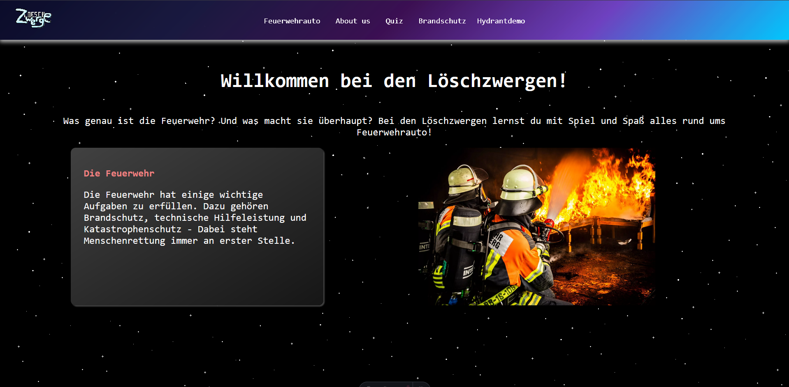
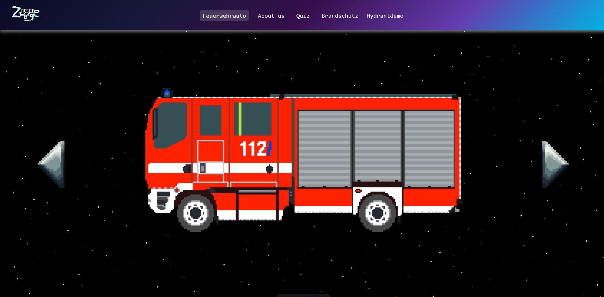
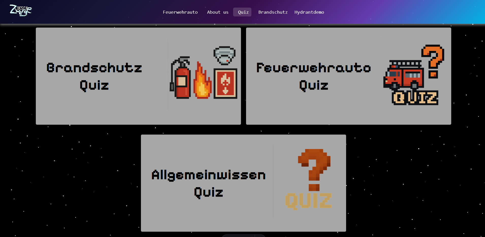
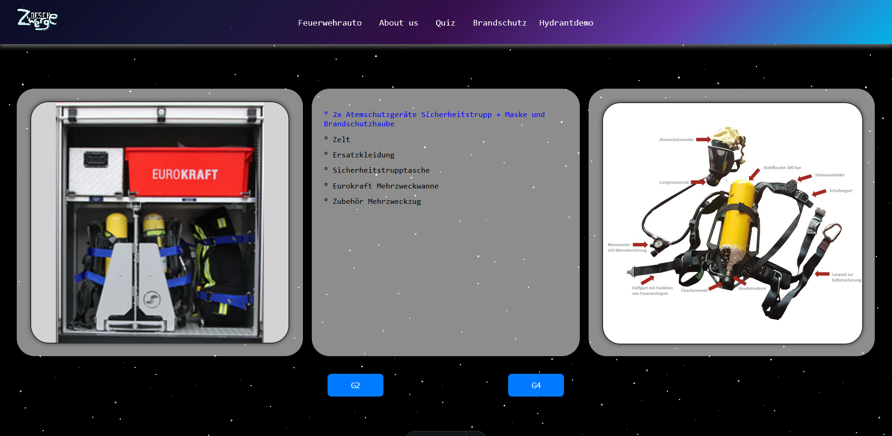

# LoeschZwerge

**LoeschZwerge ist eine interaktive Lernwebsite, welche, unabhängig vom Alter, versucht das Feuerwehrwesen spielerisch näher zu bringen.
Das Ziel der Website ist es, durch unser interaktives Feuerwehrauto, Lernvideos oder ähnlichem Kontent Wissen anzueignen, welches daraufhin in einem passenden Quiz abgefragt wird. Dabei werden Grundlagen der Feuerwehr, aber auch komplexere Themen berücksichtigt.**

# **Inhaltsverzeichnis** 
1. [**Übersicht der Website**](#übersicht-der-website)
2. [**Besondere Funktionen**](#besondere-funktionen)
3. [**Wie erreicht man die Website**](#wie-erreicht-man-die-website)
4. [**Geplante Features für die Zukunft**](#geplante-features-für-die-zukunft)

## **Übersicht der Website**
Die Website ist grundsätzlich in drei Teile aufgebaut. Es gibt die Startseite, welche Grundlagen der Feuerwehr nennt und erklärt, aber auch auf die Funktionen der Website hinweist. Dann gibt es einen Teil, welcher durch interaktives Design dem Benutzer Wissen vermittelt, welches schließlich durch passende Quizze geprüft werden kann.

[**Inhaltsverzeichnis**](#inhaltsverzeichnis)

## **Besondere Funktionen**

**Interaktive Rolltore**

Sobald man als Nutzer mit einem der Rolltore des Fahrzeugs interagiert, öffnet sich eine neue Seite, auf welcher der Inhalt des gewählten Rolltors gezeigt, beschrieben und erklärt wird. Durch Interaktion mit den Elementen der mittleren Liste wird das Gerät ausgewählt, welches darauf hin im rechten Bild angezeigt wird. Durch Interaktion mit dem rechten Bild, kann man dann noch mehr über das Gerät selbst erfahren.

[**Inhaltsverzeichnis**](#inhaltsverzeichnis)

## **Wie erreicht man die Website**
    Es gibt zwei Wege, um die Website zu erreichen.

### **1. Aufrufen durch GitHub-Pages (für normale Nutzer empfohlen)**
    Der einfache Weg, um die Website zu erreichen, ist über den GitHub-Pages-Link:  
<a href="https://vsleo.github.io/LoeschZwerge/" target="_blank">https://vsleo.github.io/LoeschZwerge/</a>
### **1. Aufrufen durch GitHub-Pages (für normale Nutzer empfohlen)**
    Der einfache Weg, um die Website zu erreichen, ist über den GitHub-Pages-Link:  
<a href="https://vsleo.github.io/LoeschZwerge/" target="_blank">https://vsleo.github.io/LoeschZwerge/</a>

### **2. Starten durch local host (für Entwickler empfohlen)**
    1. Projekt über GitHub klonen oder als zip-Datei herunterladen
    2. Das Terminal der Entwicklungsumgebung öffnen
    3. Durch das Kommando "npm install" alle notwendigen Dependencies installieren
    4. Durch das Kommando "npm run dev" den local host starten
    5. Interaktion mit folgendem Link im Terminal "http://localhost:xxxx/LoeschZwerge/"
[**Inhaltsverzeichnis**](#inhaltsverzeichnis)

## **Geplanter Kontent und Features für die Zukunft**

### **Belohnungen für erfolgreich abgeschlossenne Quizze**
    In Zukunft soll für das erfolgreiche Abschließen der Quizze Sammelobjekte erhalten werden.
    Dabei handelt es sich voraussichtlich um Sammelkarten im Pixel-Style, welche zu dem Thema Feuerwehrzwerge passen.
    Inwiefern der Sammelfortschritt gespeichert wird, steht noch nicht fest.

### **Brandschutz und weitere Prävention**
   Viele Unfälle und Brände können leicht vermieden, bzw. schnell unter Kontrolle gebracht werden.
   Deshalb liegt unser Fokus weiterhin dabei, Brandschutz und simple Erstmaßnahmen zu vermitteln,
   die oft schlimmeres verhindern können.

### **Page für Erste-Hilfe**
    Es ist ebenfalls eine Page vorgesehen, welche sich mit der Aufklärung über Erste-Hilfe befasst. 
    Die Seite soll stark Kontent-Basiert sein und durch gezielt gewählte Bilder die richtige Erste-Hilfe vermitteln,
    welche selbst durch Laien problemlos durchgeführt werden kann.

### **Informationen über den Standardangriff nach FwDv3**
    Außerdem ist es vorgesehen, durch eine interaktive Karte den standard Löschangriff nach FwDv3 zu erläutern. 
    Hierbei soll ein Schema genutzt werden, das durch interaktive Hotspots das Wissen spielerisch vermittelt. 
    Das Schema repräsentiert den Fertig aufgebauten Löschangriff.

[**Inhaltsverzeichnis**](#inhaltsverzeichnis)

